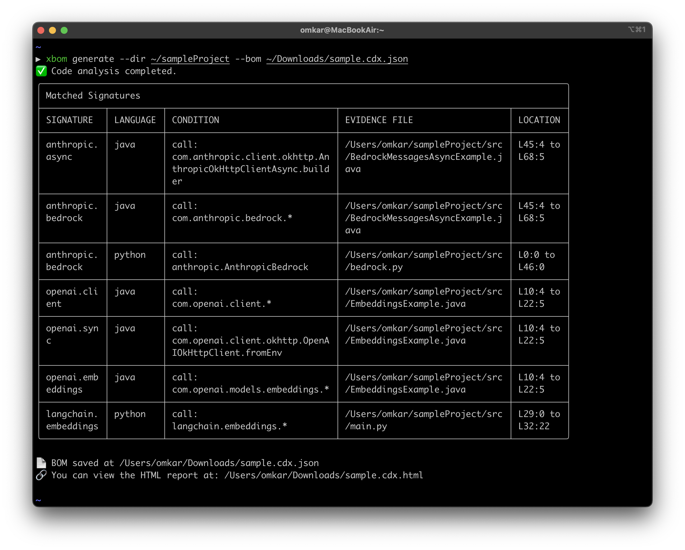
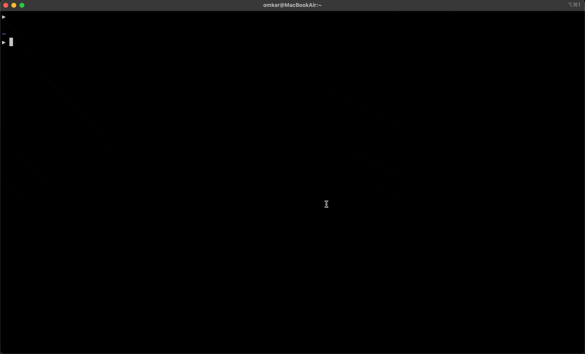

<div align="center">
  <h1>SafeDep xBom</h1>
  <p><strong>Generate BOMs enriched with AI, SaaS and more using Static Code Analysis</strong></p>
</div>

<div align="center">
  
  [](https://goreportcard.com/report/github.com/safedep/xbom)
  [](https://github.com/safedep/xbom/blob/main/LICENSE)
  [](https://github.com/safedep/xbom/releases)
  [](https://api.securityscorecards.dev/projects/github.com/safedep/xbom)
  [](https://slsa.dev)
  [](https://github.com/safedep/xbom/actions/workflows/codeql.yml)
  [](https://pkg.go.dev/github.com/safedep/xbom)

</div>

## 🎯 Why xbom?

Modern applications rely on so much more than just open-source libraries. They often include:

- AI SDKs 🧠
- ML models 🤖
- 3rd party SaaS APIs ☁️
- Cryptographic algorithms 🔑

`xbom` is designed to build comprehensive bill of material (BOM) for software dependencies
beyond just 3rd party libraries, using semantic code analysis and simple YAML based signatures.

✅ **Beyond Manifests** - `xbom` builds inventory using actual evidence from your codebase

✅ **Extensible Signatures** - add your own signatures over community maintained repository

✅ **Robust Compliance** - single tool to comply with all your software supply chain compliances

✅ **Multi-ecosystem support** — Java, Python, Go and more coming up !

## 👀 xbom in action

<div align="center">
  
</div>

## ⚡ Quick Start

```bash
# Installation on macOS & Linux
brew install safedep/tap/xbom
```

or download a **[pre-built binary](https://github.com/safedep/xbom/releases)**

```bash
# Generate BOM for your source code
xbom generate --dir /path/to/code --bom /path/to/bom.cdx.json
```

This will generate a [CycloneDX v1.6](https://cyclonedx.org/docs/1.6/json/) SBOM with AI components detected in the code base.

## Supported Languages

Currently, `xbom` supports the following programming languages:

| Language   | Status    |
| ---------- | --------- |
| Python     | ✅ Active |
| Java       | ✅ Active |
| Go         | ✅ Active |
| Javascript | ✅ Active |

## Supported BOMs

<div align="center">
  <h1><strong>AI</strong></h1>
  <table>
    <tr>
      <td align="center" width="250">
        
      </td>
      <td align="center" width="250">
        
      </td>
    </tr>
    <tr>
      <td align="center" width="250">
        
      </td>
      <td align="center" width="250">
        
      </td>
    </tr>
  </table>
</div>

<div align="center">
  <h1><strong>Cloud</strong></h1>
  <table>
    <tr>
      <td align="center" width="250">
        
      </td>
      <td align="center" width="250">
        
      </td>
    </tr>
  </table>
</div>

<div align="center">
  <strong>ℹ️ To request support for a new framework, please <a href="https://github.com/safedep/xbom/issues/new">create an issue</a>.</strong>
</div>

## 👀 Visual convenience

We generate BOMs as JSON files following [CycloneDX SPEC](https://cyclonedx.org/docs/1.6/json/). For a quick overview, you can view the BOM in an interactive HTML output linked in console output.

<div align="center">
  
</div>

## Development

### Signatures

`xbom` maintains community driven signatures for popular SDKs, APIs and libraries in `signatures/` following file naming convention - `signatures/$vendor/$product/$service.yml`. To add new signatures, refer [contributing signatures guide](CONTRIBUTING.md#contributing-signatures).

## Contributing

Refer to [CONTRIBUTING.md](CONTRIBUTING.md)

## Limitations

`xbom` is currently limited to AI BOM generation only. It uses static code analysis to identify AI products used in the code base. For generating a more comprehensive SBOM with library dependencies, you can use [vet](https://github.com/safedep/vet).

## Telemetry

`xbom` collects anonymous telemetry to help us understand how it is used and
improve the product. To disable telemetry, set `XBOM_DISABLE_TELEMETRY` environment
variable to `true`.

```bash
export XBOM_DISABLE_TELEMETRY=true
```
